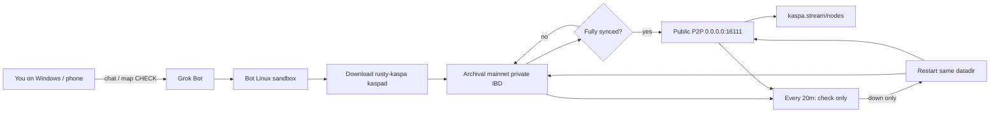

# Xai.Kaspa.node

> **TL;DR:** Paste [`GROK_BOT_PROMPT.md`](./GROK_BOT_PROMPT.md) into Grok Bot. It runs a Kaspa **mainnet archival** node on the **bot’s Linux sandbox** (your phone/Windows needs nothing). After sync it opens P2P `16111`, checks [kaspa.stream/nodes](https://kaspa.stream/nodes), and installs a **20‑minute check-only** keep-alive (restart only if down).

One **Grok Bot** prompt to launch a **Kaspa mainnet archival** full node, sync it, make **P2P public**, keep it alive with a **20-minute** health check, and check the public node map.

| | |
|---|---|
| Network | Kaspa **mainnet** |
| Node type | **Archival** (`kaspad --archival`) |
| Binary | Official [rusty-kaspa](https://github.com/kaspanet/rusty-kaspa) Linux amd64 release |
| Keep-alive | Check every **20 minutes**; restart & **resume** sync from the same datadir if down |
| Public map | [kaspa.stream/nodes](https://kaspa.stream/nodes) |
| Related | [nodes.kaspa.ws](https://nodes.kaspa.ws/), [arewepublicyet.com](https://arewepublicyet.com) |

## Who runs it vs who hosts it

**Grok Bot runs the node on the bot’s own Linux computer** (the sandbox attached to the chat). That is where `kaspad` lives — Linux binary, Linux process, Linux disk.

**Your Windows PC (or phone) does not host the node.** You only direct it remotely: chat, GitHub login, and checking https://kaspa.stream/nodes.

| Role | What |
|------|------|
| Operator / runner | Grok Bot agent |
| Machine | Bot’s Linux sandbox (not a VPS you rent under your name) |
| Your Windows / phone | Remote control only |

### Requirements on your phone / Windows

**Basically none.** You do not install Kaspa, open ports, or leave a PC running. Chat (and optional GitHub login / [kaspa.stream/nodes](https://kaspa.stream/nodes) CHECK) is enough.

Real requirements live on **Grok Bot’s Linux sandbox**: disk, RAM, CPU for archival IBD, outbound internet to sync, and — for a *listed* public node — inbound TCP `16111` (Cloudflare WARP often blocks that). The 20‑minute keep-alive only checks the process and restarts it if down; it cannot recreate data after a full filesystem wipe.

Same idea as SSHing into a cloud box while you sit on Windows: you steer; the process runs elsewhere.

### Cloudflare WARP (why the public IP looks odd)

Outbound traffic from the bot’s Linux box is often wrapped by **Cloudflare WARP**. Sites like ipify may show a Cloudflare IP (e.g. `104.x.x.x`), not a home ISP address. That is **egress**, not “Kaspa is a Cloudflare product.”

For the [kaspa.stream/nodes](https://kaspa.stream/nodes) CHECK to succeed, other peers must connect **in** to `IP:16111`. WARP/NAT often allows outbound sync but blocks or does not forward **inbound**. So the node can sync fine and still fail the map CHECK. A reliably public node usually needs a real VPS (or home network) with port `16111` reachable from the internet.

## Quick start

1. Open Grok Bot (mobile is fine).  
2. Copy everything under the line in [`GROK_BOT_PROMPT.md`](./GROK_BOT_PROMPT.md).  
3. Send it. Wait for sync; the bot should CHECK your IP on [kaspa.stream/nodes](https://kaspa.stream/nodes) with port **16111**.  
4. Leave the 20‑minute keep-alive routine enabled.

## The one prompt

Copy the entire prompt from [`GROK_BOT_PROMPT.md`](./GROK_BOT_PROMPT.md) into a Grok Bot chat and send it.

That single message is enough: download `kaspad`, run archival IBD privately, flip to public P2P after sync, install a 20‑minute keep-alive, and look the node up on the stream map.

## How it works (short)

1. **Prebuilt `kaspad`**  
   Grok Bot pulls the latest `rusty-kaspa-*-linux-amd64.zip` from GitHub Releases and runs `kaspad` on the bot’s Linux sandbox. Compiling on a small box is avoided.

2. **Archival**  
   `--archival` does **not** delete old block data when the pruning point moves. Full history = much more disk than a pruned node.

3. **Private until synced**  
   During IBD, P2P listen stays on `127.0.0.1` (no inbound). RPC always stays on localhost. Outbound peers still sync the chain.

4. **Public after sync**  
   Rebind P2P to `0.0.0.0:16111`, set `--externalip=<public-ip>:16111`, allow inbound. **Public = P2P 16111**, not open RPC.

5. **20-minute keep-alive (check only; restart only if down)**  
   Sandboxes can kill processes or reboot. The prompt installs a standing **`@every 20m`** routine (24/7) that **only checks** health:  
   - If `kaspad` is up and still archival → **do nothing** (no restart, no notify)  
   - If **down** → restart with the **same datadir** (resume IBD / tip follow; do not wipe), same private-or-public mode, notify once  
   Never restart a healthy node “just in case.”  
   This cannot recreate blocks if the filesystem was erased, but it will bring the process back if it merely died while the datadir is intact.

6. **Show up on the map**  
   **https://kaspa.stream/nodes** — look up the bot box’s public IP, port `16111`. Crawlers can take minutes or longer. WARP/CGNAT without a reachable inbound path may block listing even when `kaspad` is listening.

## Ports (defaults)

| Role | Port | Public? |
|------|------|--------|
| P2P | `16111` | Yes, after sync (if inbound is reachable) |
| gRPC | `16110` | No — `127.0.0.1` only |
| wRPC borsh / json | `17110` / `18110` | No — localhost only |

## Useful flags

- `--archival` — keep full history  
- `--ram-scale=0.3` — lower memory ceilings  
- `--disable-upnp` — skip useless UPnP  
- `--externalip=IP:16111` — address advertised to peers  
- `--listen=0.0.0.0:16111` — accept inbound P2P  

Upstream: [kaspanet/rusty-kaspa](https://github.com/kaspanet/rusty-kaspa).

## Limits (honest)

- Archival needs **lots of disk** and steady bandwidth over time.  
- **Your mobile/Windows requirements ≈ none**; the node runs on the **bot’s ephemeral Linux sandbox**, not on your device and not on a VPS you own unless you move it there.  
- A 20‑minute keep-alive **only checks**; it restarts the **process** (and resumes from disk) **only if the node is down**. It cannot recreate blocks if the filesystem was erased.  
- Cloudflare WARP may prevent a successful public map CHECK even after sync.  
- This repo is an operator prompt + notes, not a hosted node service.
