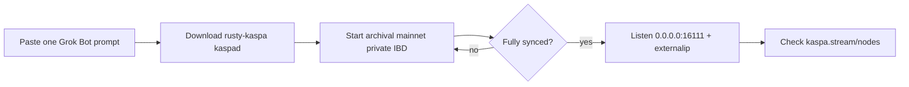

# Xai.Kaspa.node

One **Grok Bot** prompt to launch a **Kaspa mainnet archival** full node, sync it, then make **P2P public** and check the public node map.

| | |
|---|---|
| Network | Kaspa **mainnet** |
| Node type | **Archival** (`kaspad --archival`) |
| Binary | Official [rusty-kaspa](https://github.com/kaspanet/rusty-kaspa) Linux amd64 release (not built from source unless download fails) |
| Public map | [kaspa.stream/nodes](https://kaspa.stream/nodes) |
| Related maps / checks | [nodes.kaspa.ws](https://nodes.kaspa.ws/), [arewepublicyet.com](https://arewepublicyet.com) |

## The one prompt

Copy the entire prompt from [`GROK_BOT_PROMPT.md`](./GROK_BOT_PROMPT.md) into a Grok Bot chat and send it.

That single message is enough: the bot should download `kaspad`, run archival IBD privately, flip to public P2P after sync, and look the node up on the stream map.

## How it works (short)

1. **Prebuilt `kaspad`**  
   Grok Bot pulls the latest `rusty-kaspa-*-linux-amd64.zip` from GitHub Releases and runs the `kaspad` binary. Compiling Rust on a small/ephemeral box is avoided on purpose.

2. **Archival**  
   `--archival` tells the node **not** to delete old block data when the pruning point moves. You keep history (much more disk than a pruned node). Use this only if you want a full historical store.

3. **Private until synced**  
   During Initial Block Download (IBD), P2P listen stays on `127.0.0.1` with no inbound peers. RPC stays on localhost always. The node still dials outbound peers to sync.

4. **Public after sync**  
   When IBD is done, the bot rebinds P2P to `0.0.0.0:16111`, sets `--externalip=<your-public-ip>:16111`, and allows inbound peers. **Public = P2P port 16111**, not open RPC.

5. **Show up on the map**  
   Crawlers discover nodes that accept public P2P (and related checks). Look yourself up here:  
   **https://kaspa.stream/nodes**  
   Enter your public IP (port `16111`). New nodes can take minutes to longer depending on the crawler; if the host is behind WARP/CGNAT without port forwarding, you may never be reachable even if `kaspad` is “listening.”

## Ports (defaults)

| Role | Port | Public? |
|------|------|--------|
| P2P | `16111` | Yes, after sync (this is what the map cares about) |
| gRPC | `16110` | No — bind `127.0.0.1` only |
| wRPC borsh / json | `17110` / `18110` | No — localhost only |

## Useful flags (reference)

- `--archival` — keep full history  
- `--ram-scale=0.3` — lower memory ceilings on small hosts  
- `--disable-upnp` — skip UPnP when it will not work  
- `--externalip=IP:16111` — address advertised to peers  
- `--listen=0.0.0.0:16111` — accept inbound P2P  

Upstream project: [kaspanet/rusty-kaspa](https://github.com/kaspanet/rusty-kaspa).

## Disclaimer

Running an archival node needs **a lot of disk** over time and steady bandwidth. Ephemeral sandboxes may sync for a while and then lose data on reset. This repo is an operator prompt + notes, not a hosted node service.
