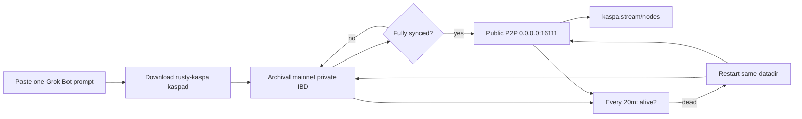

# Xai.Kaspa.node

One **Grok Bot** prompt to launch a **Kaspa mainnet archival** full node, sync it, make **P2P public**, keep it alive with a **20-minute** health check, and check the public node map.

| | |
|---|---|
| Network | Kaspa **mainnet** |
| Node type | **Archival** (`kaspad --archival`) |
| Binary | Official [rusty-kaspa](https://github.com/kaspanet/rusty-kaspa) Linux amd64 release |
| Keep-alive | Check every **20 minutes**; restart & **resume** sync from the same datadir if down |
| Public map | [kaspa.stream/nodes](https://kaspa.stream/nodes) |
| Related | [nodes.kaspa.ws](https://nodes.kaspa.ws/), [arewepublicyet.com](https://arewepublicyet.com) |

## The one prompt

Copy the entire prompt from [`GROK_BOT_PROMPT.md`](./GROK_BOT_PROMPT.md) into a Grok Bot chat and send it.

That single message is enough: download `kaspad`, run archival IBD privately, flip to public P2P after sync, install a 20‑minute keep-alive, and look the node up on the stream map.

## How it works (short)

1. **Prebuilt `kaspad`**  
   Grok Bot pulls the latest `rusty-kaspa-*-linux-amd64.zip` from GitHub Releases and runs `kaspad`. Compiling on a small box is avoided.

2. **Archival**  
   `--archival` does **not** delete old block data when the pruning point moves. Full history = much more disk than a pruned node.

3. **Private until synced**  
   During IBD, P2P listen stays on `127.0.0.1` (no inbound). RPC always stays on localhost. Outbound peers still sync the chain.

4. **Public after sync**  
   Rebind P2P to `0.0.0.0:16111`, set `--externalip=<public-ip>:16111`, allow inbound. **Public = P2P 16111**, not open RPC.

5. **20-minute keep-alive (solves “ephemeral sandbox died”)**  
   Sandboxes can kill processes or reboot. The prompt installs a standing **`@every 20m`** routine (24/7):  
   - If `kaspad` is up and still archival → stay quiet  
   - If dead → restart with the **same datadir** (resume IBD / tip follow; do not wipe), same private-or-public mode, notify once  
   This does **not** survive a total disk wipe of the VM image, but it does survive process crashes and most agent restarts as long as `/tmp` (or your chosen datadir) still has the chain data.

6. **Show up on the map**  
   **https://kaspa.stream/nodes** — look up your public IP, port `16111`. Crawlers can take minutes or longer. WARP/CGNAT without a reachable inbound path may block listing even when `kaspad` is listening.

## Ports (defaults)

| Role | Port | Public? |
|------|------|--------|
| P2P | `16111` | Yes, after sync |
| gRPC | `16110` | No — `127.0.0.1` only |
| wRPC borsh / json | `17110` / `18110` | No — localhost only |

## Useful flags

- `--archival` — keep full history  
- `--ram-scale=0.3` — lower memory ceilings  
- `--disable-upnp` — skip useless UPnP  
- `--externalip=IP:16111` — address advertised to peers  
- `--listen=0.0.0.0:16111` — accept inbound P2P  

Upstream: [kaspanet/rusty-kaspa](https://github.com/kaspanet/rusty-kaspa).

## Limits (honest)

Archival needs **lots of disk** and steady bandwidth over time. A 20‑minute keep-alive restarts the **process** and resumes from disk; it cannot recreate blocks if the whole filesystem was erased. Prefer a durable data path when the host offers one. This repo is an operator prompt + notes, not a hosted node service.
